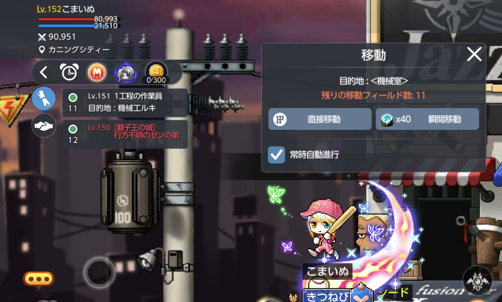
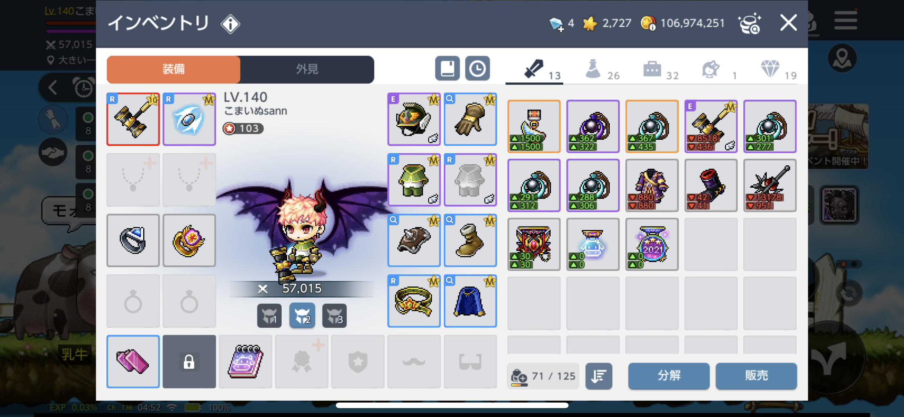
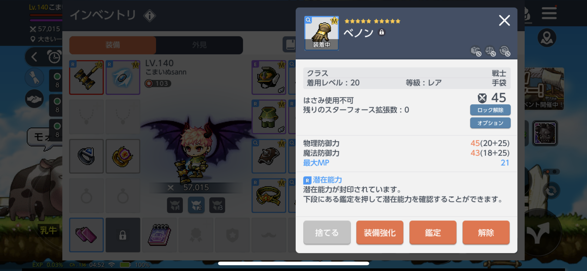
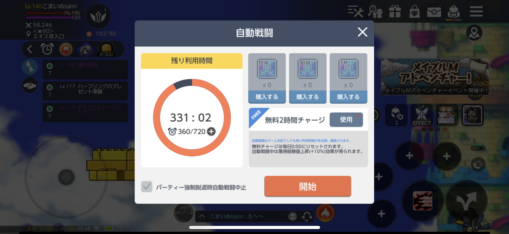
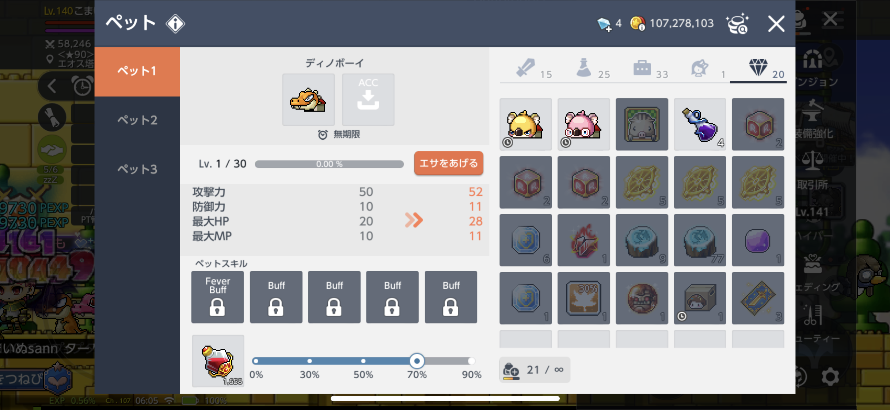
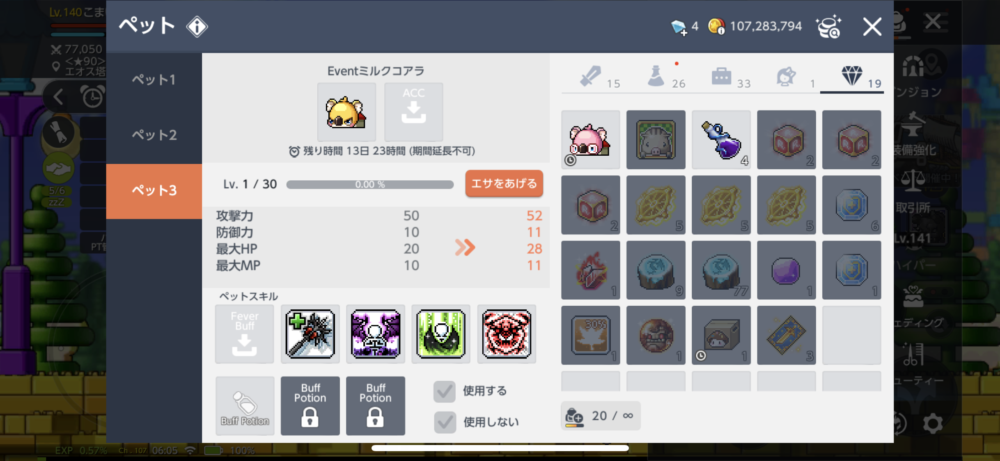
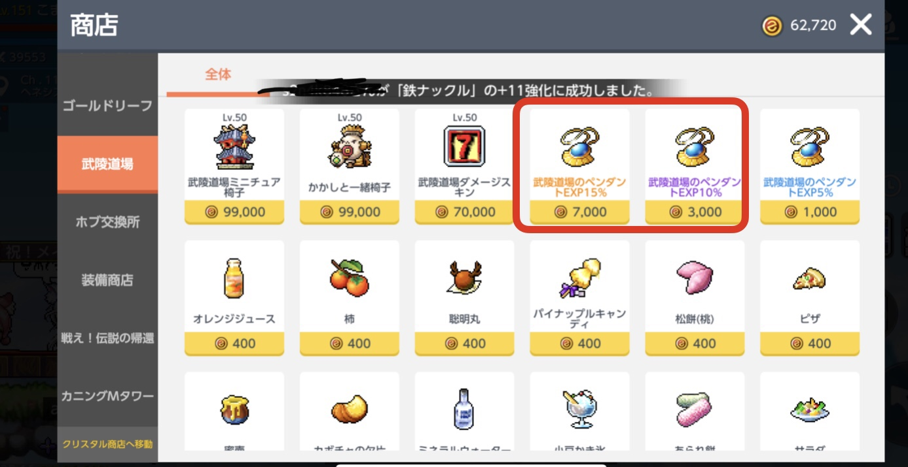

# はじめに

[メイプルストーリーM](https://mobile.nexon.co.jp/maplestorym/)(通称: メイプルM)の世界へようこそ！

どうも、[きつねび](https://kitsunebi-maple.herokuapp.com/)というギルドでマスターをしている"こまいぬ”と申します。約束の地ヘネシスで空を見つめるのがプレイスタイルな私ですが、本記事では`メイプルMを始めた人向けにキャラクラー育成のコツ`を紹介したいと思います。

### 育成の流れ

- [キャラ作成](#キャラ作成) 
- [クエスト自動プレイ](#クエスト自動プレイ)
    - [スターフォース用の装備準備](#スターフォース用の装備準備)
- [スターフォース自動狩り](#スターフォース自動狩り)
    - [ペットの回復閾値調整](#ペットの回復閾値調整)
- [ダンジョン消化(日課)](#ダンジョン消化(日課))

こんな流れです(ざっくり)。それでは早速紹介していきましょう！

# キャラ作成 

ここで悩むのが`どの職を選ぶか`という部分ですが、個人的には`最初は好きな職`を選ぶのがいいと思います。ある程度慣れてから2体目のキャラで強いキャラ等を作るのがオススメです。

どの職が強いかは、~~そもそも、私が何の職が強い知らなry~~
その時々で変わってしまったりするので、１キャラ目に仲良くなった人とかに聞くのが良かったりします。

~~べ、別に知らないから言ってるんじゃないんだからねっ~~

# クエスト自動プレイ

さて、キャラクターを作ったら早速レベルを上げていきましょう。基本的には`左上の丸い巻物みたいなボタンを押して表示されてるクエストを押すだけ`です。そうするとキャラクターが勝手に動いてクエストを進めてくれます。

アプリを終了したり、バックグラウンドに入ると自動プレイが止まっちゃいます。

この自動プレイを大体`60~90レベルくらい`までやります。スターフォース(スタフォ)狩りまでの繋ぎです。できるだけクエスト自動プレイでレベルを上げておくと、オート券を節約することができます。90lvくらいのクエストから、経験値の入りが悪くなるので、メインはスタフォ狩りに切り替えましょう。

## スターフォース用の装備準備

結論から言うと、`クエスト自動プレイ中に20レベルの防具を強化`してスタフォ狩りに入る準備をします。

スタフォ狩りには下記の制限があります。

- キャラクターが60レベル以上である
- 狩場に合わせてスターフォースが必要

このスターフォースはスターフォース強化した装備を身につけることで溜まります。下記画像はスタフォが103溜まっている状態です。まずは、こんな感じを目指すのが良いかもしれません。

また、20レベルの防具には下記メリットがあります。
- とにかく強化コストが安い
- 20レベル防具でも基本死なない

そんな感じで、スタフォ用の装備を揃えます。武器は無理のない範囲で一番攻撃力が高い物を持つのが良いです。お金が溜まってきたら、まずは取引所で100レベル赤枠(ミスティック)武器を入手するのを目標にしましょう。

装備については、また別の機会で解説したいです。

# スターフォース自動狩り

スタフォ狩りも基本自動で行います。このレベリングは`アプリを閉じた状態
でも行うことができます`。スマホをつけっぱなしにしなくてもOKです！！

___右上のメニュー > ダンジョン > スターフォースフィールド___

この操作でスターフォースフィールドに入れます。基本的には`推奨レベルの場所を選び、適当なパーティを見つけて加入申請を押してパーティに入り、グループ狩をする`流れになります。大体は自動で加入申請をOKしてくれるパーティなので気にせず入りましょう。

マップに入ったら、画面下のある __Auto__ ボタンを押して __開始__ を押します。

この開始は左側のゲージが溜まっていないと押せません。貯めるには、オート券または２時間の無料チャージを使います。また、開始を押すとこのゲージが減ります。

開始後はキャラクターの上に剣と盾のマークが表示され自動で狩りをします。これが表示されればアプリを閉じても大丈夫です。

## ペットの回復閾値調整

デフォルトの設定だと、スタフォ狩り中にキャラクターが死んでしまう場合があります。そんな時は回復の閾値を上げたり、回復量が多いポーションに切り替えたりすることで死ななくなります。

 

大体、`HP回復の閾値は70~90%程度`で設定するのが良いと思います。

ちなみに配布でもらえるペットや取引所で売っているペットには、自分のバフスキルをセットすることができます。そうすると勝手にペットがバフスキルをかけてくれます。そのバフスキルでステータスをあげる方法も一般的です。

 

# ダンジョン消化(日課)

100レベルにもなってくると、行けるダンジョンの種類も増えていきます。ダンジョンが基本的に一日に行ける回数が決まっているので、それを消化することを日課と呼んでます。

詳しい説明は省きますが、今回は初期のレベリングにおいておすすめの日課を紹介します。

- モンスターカーニバル
- エボルビングシステム
- 武陵道場 
- ネオトウキョウ

`モンスターカーニバル`と`エボルビングシステム`は、入ったら基本的に自動で狩をし始めるので、それに任せていればOKです。これを毎日可能な限りやると良いでしょう。

`武陵道場`は、最低１週間に1回やればOKです。週一でやることで月曜日に道場のポイントをもらうことができます(商店を覗くとポイントが手に入ったはず)。そのポイントを使って経験値が美味しいネックレスを２つ手に入れればOKです。

___右上のメニュー > 商店 > コンテンツ商店 > 武陵道場___

 
※少し古い画像です。ネックスレスは赤枠で囲ったものをそれぞれ買って、２つを装備して下さい。

`ネオトウキョウ`はめちゃくちゃ経験値が美味しいですが、基本的に１回しかできず周回はできないです。ただボスは１日１回の頻度で周回することができます。

説明は以上となります。

# 最後に

この記事で書いたことが必ず正解という訳ではないですが、参考にしていただければ幸いです。また、ギルドに入って人と交流するっていう楽しみ方もありますので、色々なことに挑戦して楽しみを見つけるのも良いと思います！

もし何かわからないことがあれば、お気軽に[@komainu_maple](https://twitter.com/komainu_maple)まで、ご連絡下さい！！

